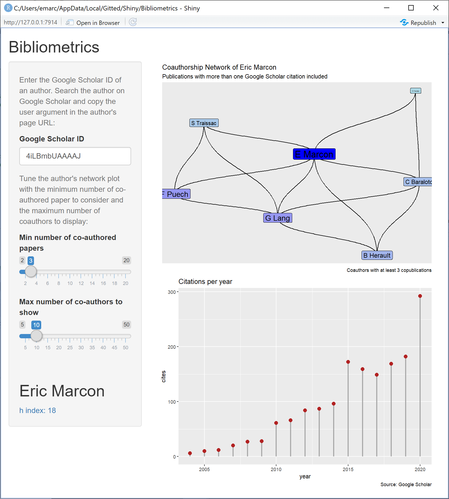

# Bibliometrics

A shiny application relying on Google Scholar (queried through the [scholar](http://github.com/jkeirstead/scholar) package).
Choose an author and get her co-author network, number of citations per year and h index.



Run `app.R` and enter the Google Scholar ID of an author.

Run it directly from GitHub in RStudio:
```
library("shiny")
runGitHub("EricMarcon/Bibliometrics")
```
